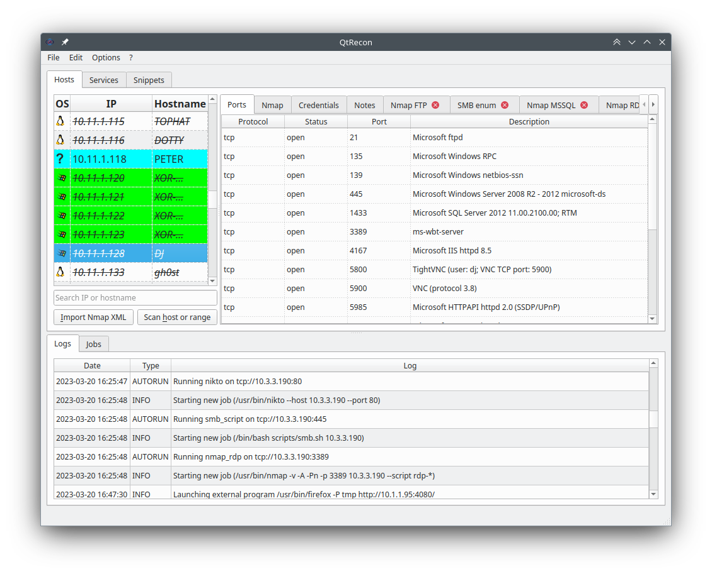
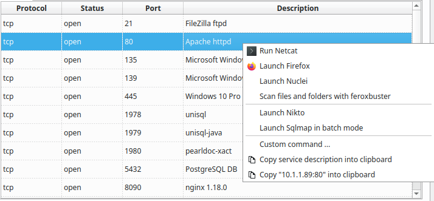

# QtRecon
## Why ? 

This tool is **heavily** inspired from the Sparta project (https://github.com/SECFORCE/sparta/) ; if you take a close look, you _might_ find some similarities ;-)
I loved the idea of SPARTA, but few elements spoiled the fun for me (missing features & global behavior), I wanted to see if I was capable to create my own version, that would be a better fit for me. Made this tool during my OSCP, and it helped me a lot during the lab and the exam. The base configuration included here is the one I used. 

## What is it ?

QtRecon aims at automating and speeding up all your recon phase. It can launch programs automatically when ports are up on a target, or let you launch your favorite tools interactively. It can also store notes and snippets you use very often. This means that a lot of configuration is expected from you, to set all programs and autorun settings.



Your workspace can be saved and loaded at will. The output file is a sqlite database, meaning you can edit it by hand if you want to.

## Installation

Pipenv install:

```bash
$ pipenv install
$ cp conf.json.example conf.json
$ pipenv run python qtrecon.py
```

## Configuration

Configuration is a key element of QtRecon. The behavior of the tool, and all external commands can be customized that way. A single json contains all settings, and if many default values are unlikely to be changed, every pentester will have to create his own setup.

Most of the customization resides in the *user_binaries*, *port_associations*, *autorun*, and *user_prefs* sections :

- *core_binaries* : contains main programs used, such as nmap, graphical console program and pkexec for elevated scan 
- *user_binaries* : contains all program used, with the arguments, working directory, and other settings
- *ports_associations* : tell which program can be used on which network port
- *autorun* : specifies which program on which port should be launched automatically upon discovery
- *user_prefs* : options should be self-explanatory

### core_binaries

This section contains the path to nmap, pkexec, your favorite graphical terminal, and their associated arguments.

### user_binaries

This section defines all your programs to use with QtRecon. At this point, you should declare every program that you use during your assessment, whether those tools must launched automatically or manually (this behavior is configured in a later section).

The following example defines the program *Firefox* to be launched as detached (no tab will be created upon execution), with an icon to decorate the entry in the menu, using a temporary profile:

```json
    "user_binaries": {
        "firefox": {
            "name": "Firefox",
            "text": "Launch Firefox",
            "detached": true,
            "in_terminal": false,
            "binary": "/usr/bin/firefox",
            "icon": "/usr/share/icons/hicolor/256x256/apps/firefox.png",
            "args": ["-P", "tmp", "http://%%%IP%%%:%%%PORT%%%/"],
            "working_directory": "/tmp"
        }
    },
 ```

Not all options are mandatory, as "in_terminal" (defaults to false), "working_dir" and "icon" are optional.

### ports_associations

The ports_associations section defines associations between programs previously declared and remote services discovered, identified by their level 4 protocol (TCP / UDP), and network port number. It allows you to run a program with a right click on a service :



The following configuration links firefox and netcat to all tcp service found, nikto to ports 80 and 443, and enum4linux for port 139 and 445:

```json
    "ports_associations": {
        "tcp" : {
            "any": [
                "netcat",
                "firefox",
            ],
            "80": [
                "nikto"
            ],
            "139": [
                "enum4linux-ng"
            ],
            "443": [
                "nikto"
            ],
            "445": [
                "enum4linux-ng"
            ]
        },
        "udp": {
            "161": [
                "onesixtyone"
            ]
        }
    }
```

### autorun

The autorun section defines programs to be run automatically when ports are found. The structure is the same as the ports_associations section. The following config automatically runs nuclei as soon as any TCP port is open on a target, and a dirb command for 80 and 443 ports :

```json
"autorun": {
        "tcp": {
            "any": [
                "nuclei"
            ],
            "80": [
                "dirb_http"
            ],
            "443": [
                "dirb_https"
            ]
        }
    }
```


# Privileged scans

The final XML file created by root must be readable by your user, meaning that a restrictive umask won't let you parse nmap run as root (needed for OS detection and syn scan mode). In that case, you have to run this tool as root, and put an empty string in core_binaries->graphical_su->binary

# Changelog & Todos

## Changelog

v1.2:
- Bug fixes
- Added the credentials tab for every hosts

v1.1:
- Improved code for handling snippets
- Can now drag & drop or paste pictures into the note field
- bug fixes

## Todo list

- [x] Escaped chars in snippet tab
- [x] Configuration template
- [x] Save-as and Save in menu
- [x] Option to autosave
- [x] First argument with the database to open
- [x] Autorun any à fixer
- [x] Snippets : only use list of list, where the first element is the title
- [x] Fixed font for snippets
- [ ] Remove sharename variable & unify variables ? 
- [ ] Option to force edit command before an interactive run
- [ ] Save configuration from GUI
- [ ] Configure tools and configuration from GUI
- [ ] staged nmap
- [x] Warning when exiting
- [ ] Service to Host switch
- [ ] better check of conf (port association and autorun, to user_binaries, and check all mandatory fields are there)
- [ ] Add confirmation when data is about to be erased (same IP)
- [x] doc about config.cfg
- [ ] sort data in models
- [ ] search for default icons in fs ?
- [ ] notes with rich text ? Integrated cherrytree or equivalent ?
- [ ] Upgrade to PySide6

## bugs

- [x] File -> new doesn't work
- [ ] Cannot stop running privileged nmap as it was launched under pkexec