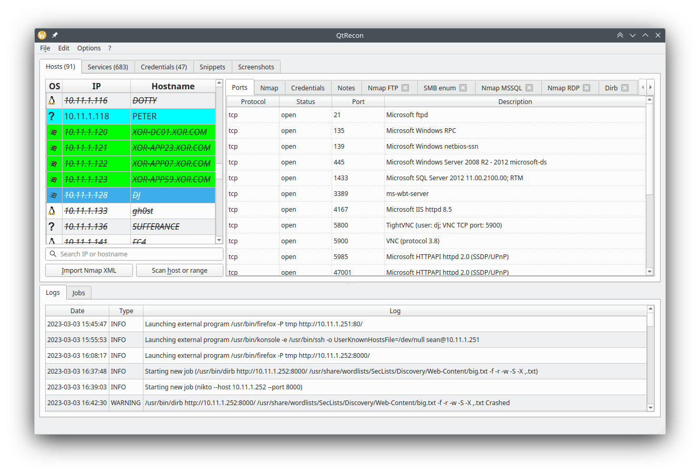

# QtRecon
## Why ? 

This tool is **heavily** inspired from the Sparta project (https://github.com/SECFORCE/sparta/) ; if you take a close look, you _might_ find some similarities ;-)
I loved the idea of SPARTA, but few elements spoiled the fun for me (missing features & global behavior), I wanted to see if I was capable to create my own version, that would be a better fit for me. Made this tool during my OSCP, and it helped me a lot during the lab and the exam. The base configuration included here is the one I used. 

## What is it ?

QtRecon aims at automating and speeding up all your recon phase. It can launch programs automatically when ports are up on a target, or let you launch your favorite tools interactively. It can also store notes and snippets you use very often. This means that a lot of configuration is expected from you, to set all programs and autorun settings.



Your workspace can be saved and loaded at will. The output file is a sqlite database, meaning you can edit it by hand if you want to.

## Installation

Pipenv install:

```bash
$ pipenv install
$ cp conf.json.example conf.json
$ pipenv run python qtrecon.py
```

## Configuration

Configuration is a key element of QtRecon. The behavior of the tool, and all external commands can be customized that way. A single json contains all settings, and if many default values are unlikely to be changed, every pentester will have to create his own setup.

Most of the customization resides in the *user_binaries*, *port_associations*, *autorun*, and *user_prefs* sections :

- *core_binaries* : contains main programs used, such as nmap, graphical console program and pkexec for elevated scan 
- *user_binaries* : contains all program used, with the arguments, working directory, and other settings
- *ports_associations* : tell which program can be used on which network port
- *autorun* : specifies which program on which port should be launched automatically upon discovery
- *user_prefs* : options should be self-explanatory
- "user_variables" : variables to be replaced automatically in commands
- "snippets" : pieces of codes often used
- "screenshots" : settings for the screenshot module

### core_binaries

This section contains the path to nmap, pkexec, your favorite graphical terminal, and their associated arguments.

### user_binaries

This section defines all your programs to use with QtRecon. At this point, you should declare every program that you use during your assessment, whether those tools must launched automatically or manually (this behavior is configured in a later section).

The following example defines the program *Firefox* to be launched as detached (no tab will be created upon execution), with an icon to decorate the entry in the menu, using a temporary profile:

```json
    "user_binaries": {
        "firefox": {
            "name": "Firefox",
            "text": "Launch Firefox",
            "detached": true,
            "in_terminal": false,
            "binary": "/usr/bin/firefox",
            "icon": "/usr/share/icons/hicolor/256x256/apps/firefox.png",
            "args": ["-P", "tmp", "http://%%%IP%%%:%%%PORT%%%/"],
            "working_directory": "/tmp"
        }
    },
 ```

Not all options are mandatory, as "in_terminal" (defaults to false), "working_dir" and "icon" are optional.

### ports_associations

The ports_associations section defines associations between programs previously declared and remote services discovered, identified by their level 4 protocol (TCP / UDP), and network port number. It allows you to run a program with a right click on a service :


The following configuration links firefox and netcat to all tcp service found, nikto to ports 80 and 443, and enum4linux for port 139 and 445:

```json
    "ports_associations": {
        "tcp" : {
            "any": [
                "netcat",
                "firefox",
            ],
            "80": [
                "nikto"
            ],
            "139": [
                "enum4linux-ng"
            ],
            "443": [
                "nikto"
            ],
            "445": [
                "enum4linux-ng"
            ]
        },
        "udp": {
            "161": [
                "onesixtyone"
            ]
        }
    }
```

### autorun

The autorun section defines programs to be run automatically when ports are found. The structure is the same as the ports_associations section. The following config automatically runs nuclei as soon as any TCP port is open on a target, and a dirb command for 80 and 443 ports :

```json
"autorun": {
        "tcp": {
            "any": [
                "nuclei"
            ],
            "80": [
                "dirb_http"
            ],
            "443": [
                "dirb_https"
            ]
        }
    }
```

### user_variables

Variables to be replaced automatically in commands. In this example :

```json
    "user_variables": {
        "XFREERDP_KEYBOARD": "0x0000040C"
    },
```

every instance of %%%XFREERDP_KEYBOARD%%% in a command line will be replaced with the corresponding value 0x0000040C. Values can be changed at runtime through the GUI (Edit -> Edit custom variables)

### snippets

This section contains all pieces of code often used for quick reference. It can be reverse shell, cheatsheets, whatever . Syntax is as follow :

```json
    "snippets": {
        "Title of tab":
        [
            "Headline 1",
            [
                "<code content>",
                "<code content>"
            ],
            "Headline 2",
            [
                "Sub-headline",
                [
                    "<code content>",
                    "<code content>"
                ],
            ],
...
```

%%%LHOST%%% and %%%LPORT%%% are special variables here, replaced with what you specified in user_prefs->preferred_interfaces or user_prefs->preferred_lport.

### screenshots

The screenshot module helps when you need a screenshot you forgot to take while working. It will rely on an external tool to create a snapshot every X seconds, and compress everything in an archive :

 - engine : can be the native one "qt" (recommanded), or an "external" tool 
 - interval : Seconds between screenshots
 - dst_folder : Final destination folder where all screenshots taken are compressed into a unique archive
 - work_folder : Temporary work folder where all screenshots are taken and stored before creating the final compressed archive
 - pixel_threshold_different_images : number of different pixels from previous screenshot required to take another screenshot. It prevents taking multiple images from a screen without activity 
 - check_locked_screen : Boolean, if true, qtrecon will check if the screen is locked before taking screenshots
 - check_locked_screen_cmd : Command line to check if the screen is lockec
 - check_locked_screen_cmd_result : output from check_locked_screen_cmd that shows a locked screen
 - screenshot_cmd : command line to create a new screenshot, with %%%OUTPUT%%% as the output file
 - ignore_if_active_window : boolean, if true, qtrecon will not take a screenshot if it is the current active window
 - convert_png_to_jpg : if the screenshot_cmd produces a png image, this option will convert it to jpg to reduce its size
 - include_processes : create a dedicated sqlite database which includes all running process when the screenshot is taken.
 - include_ocr : Not implemented yet
 - processes_blacklist : This option is not visible from the GUI, it filters out all processes in the dedicated database
 - processes_ppid_blacklist : This option is not visible from the GUI, it filters out all processes which have specified ppid

# Credentials

You can add credentials for a specific host, and depending on its type (password or hash), it can be used to integrate your command line at runtime. It you launch a command with %%%PASSWORD%%% or %%%HASH%%%, and have valid credentials, QtRecon will ask if they must be used.

# Privileged scans

The final XML file created by root must be readable by your user, meaning that a restrictive umask won't let you parse nmap run as root (needed for OS detection and syn scan mode). In that case, you have to run this tool as root, and put an empty string in core_binaries->graphical_su->binary

# Changelog & Todos

## Changelog

v1.5:
- Changed the Nmap parser to slightly better capture hostnames of hosts
- Remembers current open folder when importing .xml or opening project files
- sorting enabled in the credentials tab 
- IP is now display in the credentials view
- %%%HOSTNAME%%% can be dynamically replaced
- New 'Go to Host view' feature, to get redirected to the nmap results from the service tab or password tab
- New screenshot module, to automatically screenshot your screen every X seconds (needs testing)
- Migrated to pyside6 (needs even more testing, but should be fine)

v1.4:
- Fixed a bug where the service tab wasn't updated properly
- Fixed a bug in the Nmap parser, where unvalid XML strings like '&#x1;' are now properly handled
- Compatible with masscan XML outputs
- New global view for credentials, where all creds can be seen in a single tab
- Variables DOMAIN, USERNAME, HASH, PASSWORD, SSH_KEY can be used and replaced if valid credentials are registered for current host
- Various ui improvements

v1.3:
- Increased default mainwindow size
- Fixed a crash when the reloaded configuration was incorrectly formatted
- Fixed a bug with snippet HTML rendering & changed font and background colors for snippets
- Keeps current tab focused when selecting another host

v1.2:
- Bug fixes
- Added the credentials tab for every hosts

v1.1:
- Improved code for handling snippets
- Can now drag & drop or paste pictures into the note field
- bug fixes

## Todo list

- [ ] Log changes of IP
- [ ] Option to force edit command before an interactive run
- [ ] Configure tools and configuration from GUI
- [ ] better check of conf (port association and autorun, to user_binaries, and check all mandatory fields are there)
- [ ] Add confirmation when data is about to be erased (same IP) ?
- [ ] search for default icons in fs ?
- [ ] notes with rich text ? Integrated cherrytree or equivalent ?

## bugs

- [ ] Cannot stop running privileged nmap as it was launched under pkexec
- [ ] Copy/paste doesn't work under wayland ?